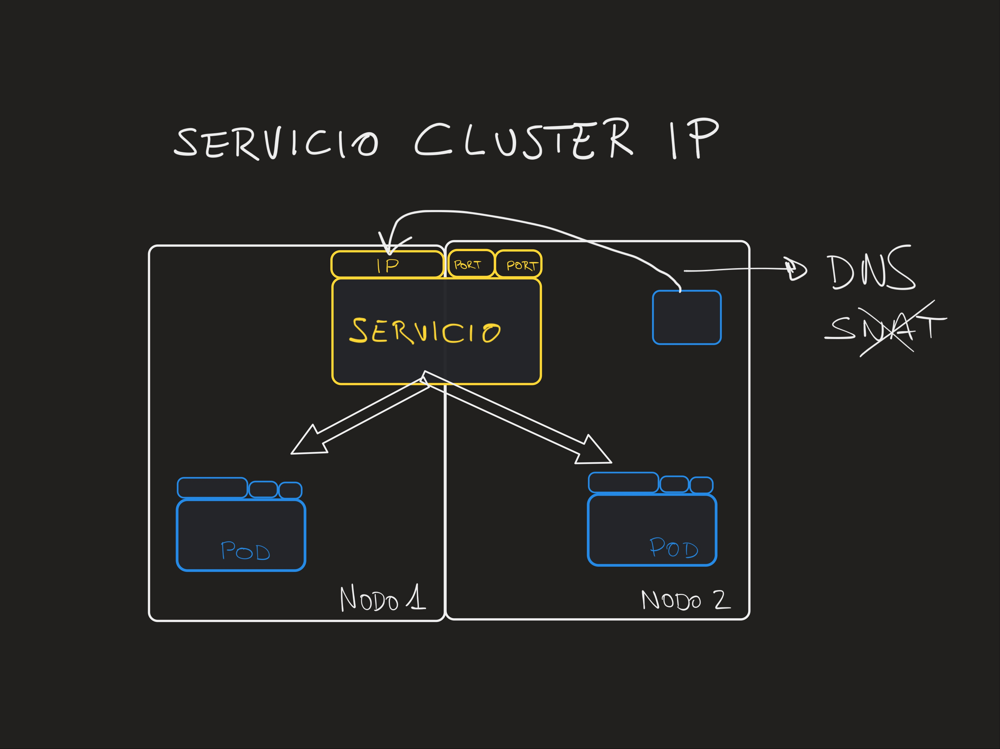
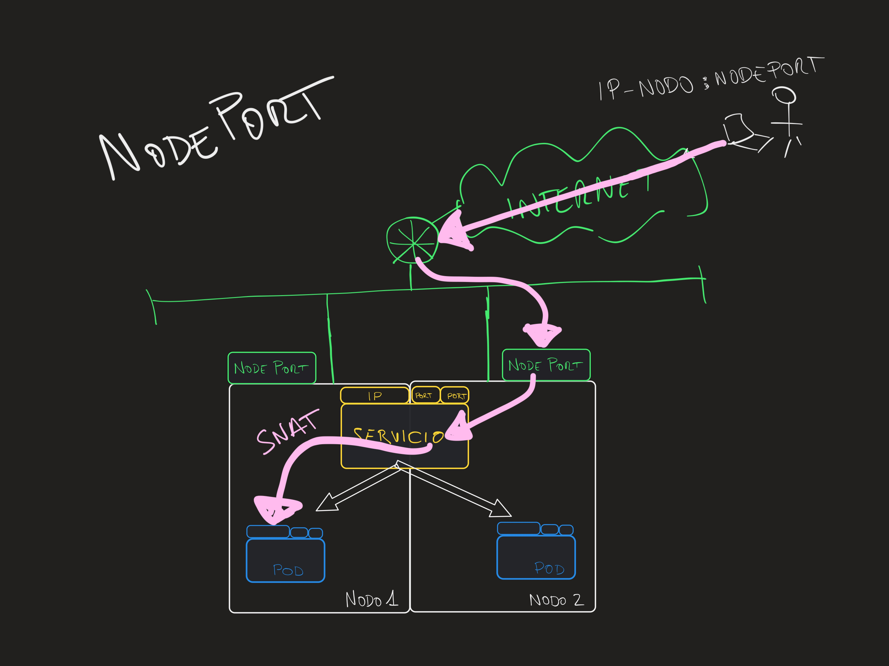
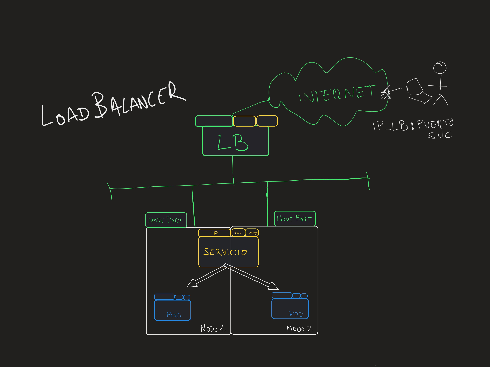
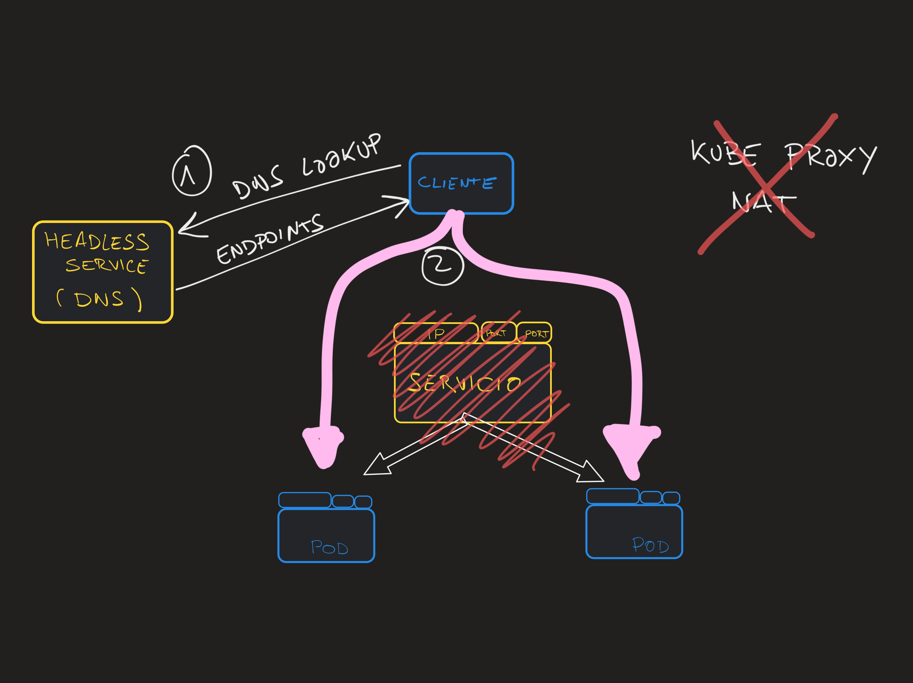

<a name="svc"></a>
## Services

In this demonstration:
* [Create deployment](#svc-dep)
* [ClusterIP](#svc-clusterip)
* [NodePort](#svc-np)
* [LoadBalancer](#svc-lb)
* [HeadLess](#svc-headless)

To demonstrate the different types of services, we will use:
- `nginx Deployment` with 2 replicas.
- A simple `Pod` to act as a client within the cluster using `busybox:1.28`.
- A `Service` object that we will modify.

<a name="svc-dep"></a>
We start by creating the deployment, which is defined (with comments) as follows:

```yaml
apiVersion: apps/v1 # API version (may vary between k8s versions)
kind: Deployment  # TYPE: Deployment
metadata: # Metadata for the Deployment
  name: nginx-deployment
  labels:
    app: nginx-dep # this label exists at the deployment level
spec: # Spec of the DEPLOYMENT
  selector:
    matchLabels:
      app: nginx
  replicas: 2 # tells the controller to run 2 pods
  template: # Here begins the POD block
    metadata: # Metadata of the POD
      labels:  # Labels of the POD (different from the deployment!)
        app: nginx
    spec: # POD specification
      containers: # POD container declaration
      - name: nginx
        image: nginx:1.7.9
        ports:
        - containerPort: 80
```

To create the deployment:

```bash
kubectl apply -f resources/nginx-dep.yaml
```

Once created, we can verify that it is running and check the logs of the associated pods with:

```bash
kubectl get pod
kubectl logs nginx-deployment-xxxxxx # the name of one of the pods
```

Next, we will create the service, with something like:

```yaml
apiVersion: v1
kind: Service
metadata:
  name: nginx # DNS name of the service
spec:
  type: ClusterIP  # TYPE (we will change it later)
  selector: # POD SELECTOR (FINAL ENDPOINTS OF THE SERVICE)
    app: nginx
  ports: # Ports opened by the service
  - protocol: TCP
    port: 80 # Listening port of the service. WE CAN CHOOSE IT.
    targetPort: 80  # Listening port of the pod. MUST BE CORRECT.
```

__IMPORTANT CONSIDERATIONS__

* Selector: it is a selector for __pods only__. It must target the labels of pods, not those of Deployments, Statefulsets, etc.
* Ports: the listening port can be chosen freely, but the `targetPort` must match exactly the port where the target pods are listening on.
  * A service can have multiple ports (a pod can also listen on multiple ports).
* Name: the service name will become the DNS name that internal clients use.

<a name="svc-clusterip"></a>

### ClusterIP
- `ClusterIP` service: provides internal access to other pods within the cluster. It is not accessible from outside the cluster.



```bash
kubectl apply -f resources/svc-ClusterIP.yaml
```

To review the details of the service:

```bash
kubectl get service nginx -o=wide
kubectl describe service nginx
```

__Testing access to the ClusterIP service__

Since the ClusterIP service is only accessible from within the cluster, we will create a test `client pod`. You can use images like `busybox:1.28`, `radial/busyboxplus:curl`, etc.

```bash
kubectl run curl-test -it --image=radial/busyboxplus:curl --rm
```

Once inside, we can check the DNS resolution and connection to the service:

```console
$ nslookup nginx
Server:    10.56.0.10
Address 1: 10.56.0.10 kube-dns.kube-system.svc.cluster.local

Name:      nginx
Address 1: 10.56.9.59 nginx.default.svc.cluster.local

$ curl nginx
<!DOCTYPE html>
<html>
<head>
<title>Welcome to nginx!</title>
<style>
    body {
        width: 35em;
        margin: 0 auto;
        font-family: Tahoma, Verdana, Arial, sans-serif;
    }
...
```

- DNS records for services follow `<service-name>.<namespace>.svc.cluster.local` nomenclature.
- DNS clients will try to append various suffixes when not provided (search domains).

__Checking NAT (SNAT / DNAT) and traffic flow__

- Look at the client pod, nginx pods, and the service to identify the IP addresses of all components (`kubectl get`).
- Check the nginx logs while performing tests to verify the source IP of the packet arriving at nginx.
- You will observe that for internal traffic, no `SNAT` is performed, as the destination pod receives the original source IP.
- `DNAT` is implemented by the service to route traffic to the destination pod.

Client pod IP:
```
[ root@curl-test:/ ]$ ip a
    inet 10.52.2.4/24 brd 10.52.2.255 scope global eth0
```

NGINX logs after running curl from the client pod:
```
10.52.2.4 - - [05/Feb/2022:08:52:30 +0000] "GET / HTTP/1.1" 200 612 "-" "curl/7.35.0" "-"
```

### NodePort
<a name="svc-np"></a>

- `NodePort` service: provides external access to the pods by opening a port in the range `30000-32767` on all nodes in the cluster.



```
kubectl apply -f resources/svc-NodePort.yaml
```

Once created, you need to check the NodePort (__automatically assigned if not specified in the service manifest__):

```
$ kubectl get service nginx -o=wide
NAME    TYPE       CLUSTER-IP   EXTERNAL-IP   PORT(S)        AGE     SELECTOR
nginx   NodePort   10.56.9.59   <none>        80:31706/TCP   9m44s   app=nginx
```

In our case, the port opened on the Kubernetes hosts is `31706`.

__Testing access to the NodePort service__

The NodePort service opens a port on all nodes of our Kubernetes cluster. To test it, we need to connect to them.

If your Kubernetes machines are in the cloud, remember that you must ensure the port is open in the firewall rules / security group or similar.

For example, in GKE:

```
gcloud compute firewall-rules create test-node-port --allow tcp:31706

# WARNING!!! The above command opens that port for all machines in the VPC!!!
# --target-tags=gke-eedugon1-<hash> might help :)
```

Once you ensure traffic is allowed, simply connect from your browser (or shell via curl) to the destination. You will need to know the actual IP addresses of your nodes. One way to get them is:

```
$ kubectl get nodes -o=wide
NAME                                        STATUS   ROLES    AGE   VERSION            INTERNAL-IP   EXTERNAL-IP     OS-IMAGE                             KERNEL-VERSION   CONTAINER-RUNTIME
gke-demo-default-pool-5a194f9d-nprx   Ready    <none>   18m   v1.21.6-gke.1500   10.138.0.2    35.230.29.12    Container-Optimized OS from Google   5.4.144+         containerd://1.4.8
gke-demo-default-pool-5a194f9d-phgm   Ready    <none>   18m   v1.21.6-gke.1500   10.138.0.4    34.82.250.102   Container-Optimized OS from Google   5.4.144+         containerd://1.4.8
gke-demo-default-pool-5a194f9d-w0r2   Ready    <none>   18m   v1.21.6-gke.1500   10.138.0.3    35.247.71.42    Container-Optimized OS from Google   5.4.144+         containerd://1.4.8
```

In this example, the accessible addresses are listed in the `EXTERNAL-IP` column. We check that all of them allow traffic and work (__regardless of whether they have a pod running on the node or not__):

```
curl http://35.230.29.12:31706
curl http://34.82.250.102:31706
curl http://35.247.71.42:31706
```

__Checking SNAT (source IP)__

- In this case, we will see that the __source IP__ detected by NGINX __is not the client IP__, but an internal cluster IP (from the node handling the traffic), confirming that for external access, `SNAT` __is__ applied to the traffic. This is generally not an issue because the client’s IP is included in the HTTP header.

```
10.52.0.1 - - [05/Feb/2022:09:03:38 +0000] "GET / HTTP/1.1" 200 612 "-" "curl/7.79.1" "-"
10.138.0.3 - - [05/Feb/2022:09:31:09 +0000] "GET / HTTP/1.1" 200 612 "-" "curl/7.79.1" "-"
10.138.0.4 - - [05/Feb/2022:09:31:17 +0000] "GET / HTTP/1.1" 200 612 "-" "curl/7.79.1" "-"
```

### LoadBalancer
<a name="svc-lb"></a>
- `LoadBalancer` service: Provides external access to the pods by creating an external LoadBalancer.



```
kubectl apply -f resources/svc-LoadBalancer.yaml
```

__Testing access to the LoadBalancer service__

The creation of the load balancer may take a few minutes. We'll wait for the IP to become available and retrieve it by checking the service:

```
$ kubectl get service nginx
NAME    TYPE           CLUSTER-IP   EXTERNAL-IP     PORT(S)        AGE
nginx   LoadBalancer   10.56.9.59   35.230.69.103   80:31706/TCP   46m
```

Testing access:
```
curl http://35.230.69.103
```

__NAT Check__

You'll notice this works similarly to the `NodePort` case. For external traffic, `SNAT` is applied, so the source IP seen by the destination is not the client's, but that of the node handling the traffic.

NGINX logs, similar to previous ones:

```
10.138.0.4 - - [05/Feb/2022:09:34:55 +0000] "GET / HTTP/1.1" 200 612 "-" "curl/7.79.1" "-"
10.138.0.4 - - [05/Feb/2022:09:34:57 +0000] "GET / HTTP/1.1" 200 612 "-" "curl/7.79.1" "-"
10.52.0.1 - - [05/Feb/2022:09:34:59 +0000] "GET / HTTP/1.1" 200 612 "-" "curl/7.79.1" "-"
```

In other cases the source IP could also be translated to the IP address of the load balancer, it depends on the implementation.

Advanced topic:
- `externalTrafficPolicy: Local` will preserve the original IP (if not translated by the load balancer). Default value is `Cluster`.

### HeadLess
<a name="svc-headless"></a>

- `HeadLess` service: Provides internal access without load balancing, directly resolving at the DNS level to the IPs of all the endpoints. `HeadLess` is not a service `type`, but rather a `ClusterIP` with the property `clusterIP: None`.



- For this test, we create a new service called `nginx-headless`:

```yaml
apiVersion: v1
kind: Service
metadata:
  name: nginx-headless
spec:
  type: ClusterIP
  clusterIP: None
  selector:
    app: nginx
  ports:
  - protocol: TCP
    port: 80
    targetPort: 80
```

We create it:

```
kubectl apply -f resources/svc-HeadLess.yaml
```

Check the service and confirm that it has no associated IP address.

__Testing access to the headless service__

As with `ClusterIP`, we will use an internal client:

```bash
kubectl run curl-test -it --image=radial/busyboxplus:curl --rm

$ nslookup nginx-headless
Server:    10.56.0.10
Address 1: 10.56.0.10 kube-dns.kube-system.svc.cluster.local

Name:      nginx-headless
Address 1: 10.52.0.4
Address 2: 10.52.2.3

$ curl 10.52.0.4
$ curl 10.52.2.3
```

Resolution hint: `<svc-name>[.<namespace>.svc.cluster.local]`

In this case, __the communication is direct between pods, without kube-proxy involvement__. There is also no NAT applied (neither `DNAT` nor `SNAT`).

NGINX logs: they show the source IP of the client pod, as expected.

```bash
10.52.2.5 - - [05/Feb/2022:09:52:12 +0000] "GET / HTTP/1.1" 200 612 "-" "curl/7.35.0" "-"
```

### End
[Back](./README.md)
